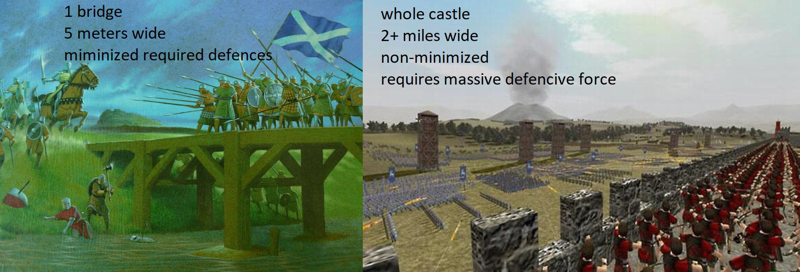

## minimization example: 
In this program, we have a simple hello world program. It is minimized in size, meaning there is much less code to secure, making it more secure. There are only two lines of working code, nearly guaranteeing ones inability to penetrate it with an attack.

cout << "Very minimalizered!";    
return 0;   

## Minimization nonexample: 
In this program, the same goal is accomplished as the example, but instead of few lines, it requires a significant amount more. The vector used to hold the characters makes it harder to guarantee the program is safe from buffer overflow and similar attacks:

void HelloWorld::sayHello()   
{   
	vector<char> hey;   
  hey.push_back('h');   
	hey.push_back('e');     
	hey.push_back('l');   
	hey.push_back('l');   
	hey.push_back('o');   
	hey.push_back(' ');   
	hey.push_back('w');   
	hey.push_back('o');   
	hey.push_back('r');   
	hey.push_back('l');   
	hey.push_back('d');   
	hey.push_back('!');   
	for (int i = 0; i <= 11; i++)   
	{   
		cout << hey[i];   
	}   
}   

The use of a class also makes it more difficult to promise completely safe implementation:

class HelloWorld    
{   
public:   
	HelloWorld();   
	~HelloWorld();    
	void sayHello();    

private:    
	string hello = "Hello World!";    
};    

These complications make securing the program unnecessarily complex, and should therefore be avoided.

