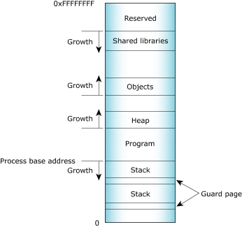

## Process Isolation example: 
In this program we have a simple IO prompt asking for a width, length, and height of a box. The main function of the program calls functions in order to post instructions, take inputs in, calculate the volume of the box, 
and finally summarize the given inputs and found volume. 

printMessage(width, length, height);    
volume = calculate(width, length, height);    
printSummary(length,height,width,volume);   

While process isolation is mainly practiced by a computer, keeping processes and tasks seperate, this program can also be a good example of it. The functions here, used to seperate the tasks of the program, are seperating the 
memory locations of the data being used and manipulated. This is an example of process isolation becase the way in which processes are seperated on a computer similarly space out the memory allocated to each process. 

## Process Isolation nonexample: 
In this version of the previous program, there is only one function (main). In this main function, all communication with the user, calculation, and storage is done in the same place. 

int width, length, height, volume;    
	cout << "BOX VOLUME CALCULATOR:\n";   
	cout << "Hello, please enter a width, length, and height for your box.\nWidth:";    
	cin >> width;   
	cout << "\nLength:";    
	cin >> length;    
	cout << "\nHeight:";    
	cin >> height;        
	cout << endl;   
	volume = length*width*height;   
	cout << "The given box has " << length << " length, " << width << " width, and " << height << " height." << endl;   
	cout << "The volume of this box is " << volume << endl;   

This program can also we used as an example of process isolation. If the processes on a computer were kept in the same set of memory, as the data is here, then manipulating a process using another would be much less
difficult, and the proccesses much less secure. 

   
(The stack seperates individual programs from one another, giving them buffer space between one another.)
