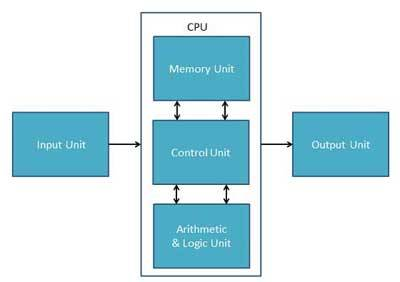

## Resource Encapsulation example: 
In this program we have a basic class holding three private variables of different types

private:    
	int iValue = 0;   
	string sValue = "";   
	bool bValue = false;    

and six accessor methods in order for the main program to access these variables.

bool goodClass::getBoolValue()    
{   
	return bValue;    
}   
void goodClass::setBoolValue(bool x)    
{   
	bValue = x;   
}   
int goodClass::getIntValue()    
{
	return iValue;    
}     
void goodClass::setIntValue(int x)    
{   
	iValue = x;   
}   
string goodClass::getStringValue()    
{   
	return sValue;    
}   
void goodClass::setStringValue(string x)    
{   
	sValue = x;   
}   

This code is a perfect example of Resource Encapsulation. All of the required data is encapsulated in a self-contained component (the class), and nothing can be done to that object without
the methods provided by said object. The only changes that can be made to the object are those that the class has allowed the user access to. The public and private modifiers on the class also
control who is able to control the class. In this case, it disallows all users access to the objects inner workings.

## Resource Encapsulation Non-Example: 
In this version of the previous program, the user is not seperated from the data. The data is instead available entirely for the user to alter directly, without the need for accessor or mutator
functions. 

public:   
	badClass();   
	~badClass();    
	int iValue= 0 ;   
	string sValue = "";   
	bool bValue = false;    

cout << "New values:\n   integer:" << badObject.iValue << "\n   String:" << badObject.sValue << "\n   Boolean:"<< boolalpha << badObject.bValue << endl;

In this case, the program still encapsulates the data in a class, but makes a fatal error in not making use of the public and private modifiers. This lack of control allows all users to access
all data member of the object, Severely damaging the programs security. 

The control unit of the CPU is used in order to control/work with the other modules of the CPU. It uses informating given from input and gives information via the output. The user
cannot control the CPU entirely via input because they are only in contact witht he control unit, therefor encapsulated. 