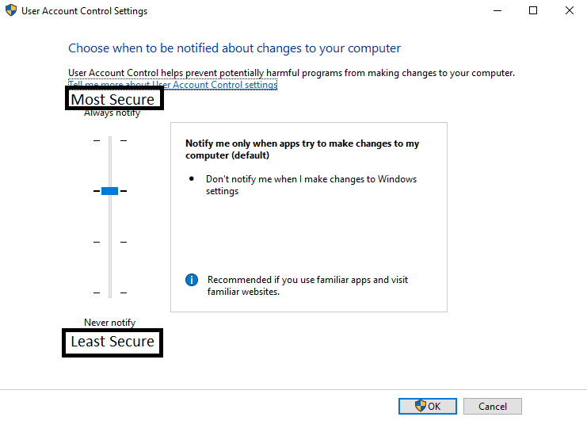

## Least Privilage example: 
In this program we have a basic class holding three private variables of different types

private:    
	int iValue = 0;   
	string sValue = "";   
	bool bValue = false;    

and six accessor methods in order for the main program to access these variables.

bool goodClass::getBoolValue()    
{   
	return bValue;    
}   
void goodClass::setBoolValue(bool x)    
{   
	bValue = x;   
}   
int goodClass::getIntValue()    
{
	return iValue;    
}     
void goodClass::setIntValue(int x)    
{   
	iValue = x;   
}   
string goodClass::getStringValue()    
{   
	return sValue;    
}   
void goodClass::setStringValue(string x)    
{   
	sValue = x;   
}   

This code is an example of Least Privilage because in order for a user to access the class variables in any way, it must do so through the accessor functions. 

cout << "New values:\n   integer:" << goodObject.getIntValue() << "\n   String:" << goodObject.getStringValue() << "\n   Boolean:" << boolalpha << goodObject.getBoolValue() << endl;   

In seperating the class variables and the main program, the user is not being given the privilage to access class variables, making the program more secure.

## Least Privilage Non-Example: 
In this version of the previous program, the main program is not denied access to the class variables, and is therefor given Privilage to them. 

public:   
	badClass();   
	~badClass();    
	int iValue= 0 ;   
	string sValue = "";   
	bool bValue = false;    

Instead of the program passing the private values of the class object through public functions, the main program is given direct access to previously private variables.

cout << "New values:\n   integer:" << badObject.iValue << "\n   String:" << badObject.sValue << "\n   Boolean:"<< boolalpha << badObject.bValue << endl;

This makes the program less secure. 

