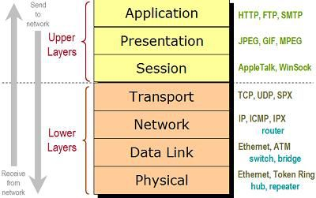

## Modulularity example: 
In this program we have a simple IO prompt asking for a width, length, and height of a box. The main function of the program calls functions in order to post instructions, take inputs in, calculate the volume of the box, and finally summarize the given inputs and found volume. 

printMessage(width, length, height);    
volume = calculate(width, length, height);    
printSummary(length,height,width,volume);   

This program is a good example of modularity because if one function is compromised, the others are not automatically compromised as well. Security is not compromised unless functions are compromised seperately.

## Modularity nonexample: 
In this version of the previous program, there is only one function (main). In this main function, all communication with the user, calculation, and storage is done in the same place. 

int width, length, height, volume;    
	cout << "BOX VOLUME CALCULATOR:\n";   
	cout << "Hello, please enter a width, length, and height for your box.\nWidth:";    
	cin >> width;   
	cout << "\nLength:";    
	cin >> length;    
	cout << "\nHeight:";    
	cin >> height;        
	cout << endl;   
	volume = length*width*height;   
	cout << "The given box has " << length << " length, " << width << " width, and " << height << " height." << endl;   
	cout << "The volume of this box is " << volume << endl;   

This allows for vulnerabilitys in one of these areas to "break" the rest of the code, due to it's non modularity. 

   
(The layers of the internet are seperate/modularized, if one layer is changed/broken/attacked, the other layers are still capable of functioning normally.)
