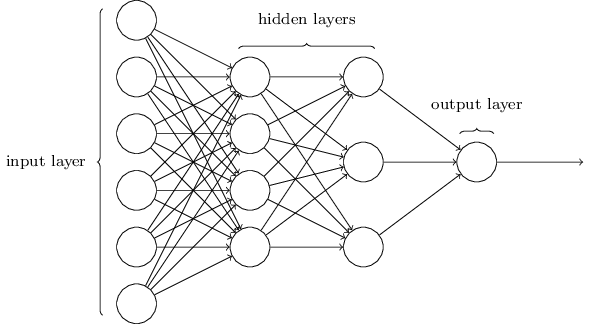

## Data Hiding example: 
In this program we have a basic class holding three private variables of different types

private:    
	int iValue = 0;   
	string sValue = "";   
	bool bValue = false;    

and six accessor methods in order for the main program to access these variables.

bool goodClass::getBoolValue()    
{   
	return bValue;    
}   
void goodClass::setBoolValue(bool x)    
{   
	bValue = x;   
}   
int goodClass::getIntValue()    
{
	return iValue;    
}     
void goodClass::setIntValue(int x)    
{   
	iValue = x;   
}   
string goodClass::getStringValue()    
{   
	return sValue;    
}   
void goodClass::setStringValue(string x)    
{   
	sValue = x;   
}   

This program is an example of data hiding because the secrecy of the objects variables are ensured. The user is not able to directly observe the data inside of the object. The object also has a "verify" 
function that would theoretically be used by the object in each of it's functions to verify the information being given. This function is also hidden to the users eye, who has no need to know that
the function exists or how it works, increasing security. 

## Data Hiding Non-Example: 
In this version of the previous program, the user is not seperated from the data. The data is instead available entirely for the user to alter directly, without the need for accessor or mutator
functions. 

public:   
	badClass();   
	~badClass();    
	int iValue= 0 ;   
	string sValue = "";   
	bool bValue = false;    

cout << "New values:\n   integer:" << badObject.iValue << "\n   String:" << badObject.sValue << "\n   Boolean:"<< boolalpha << badObject.bValue << endl;

In this program, no data is kept seperate from the users eyes. All data is public and viewable by any one, regardless of necessity. This decreases security, as the entire program is laid out in black and white
for anyone to dissect.

The "hidden layer" allowes for the given input to result in the expected output, without any of the process in the middle to be unecessarily disclosed.